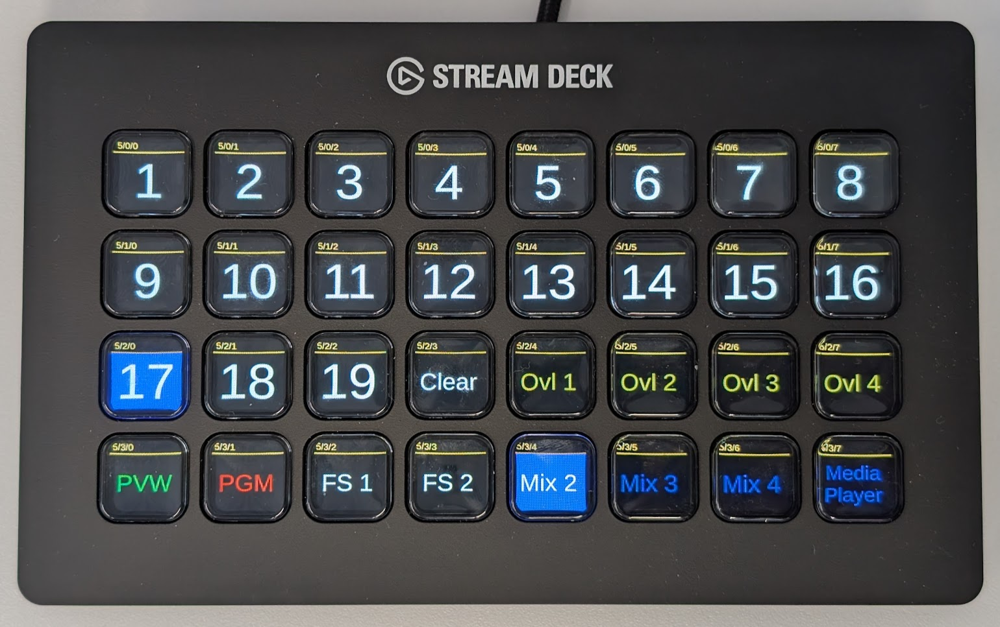
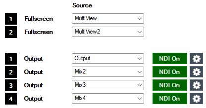
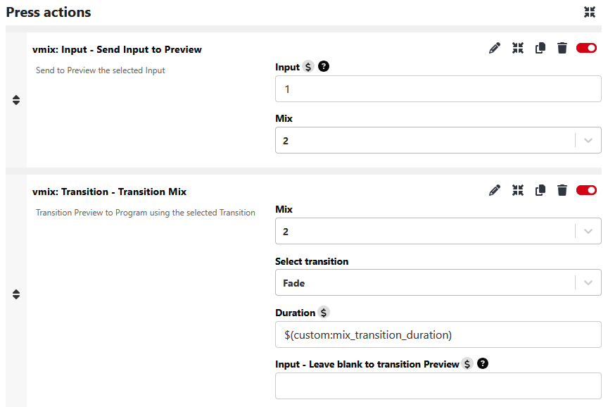

# 🤖 FIRST Global Slovakia 2025 – AV Production & Infrastructure

This repository documents the **audiovisual (AV) production and technical infrastructure** used during  
**[FIRST Global Slovakia 2025](https://firstglobal.sk/)**, a national high school robotics competition hosted at the **[Aurelium science experience center](https://aurelium.sk)** in Bratislava, Slovakia.

The event brought together students from across Slovakia — and abroad — to collaborate, compete, and innovate in a day-long robotics challenge inspired by the global **[FIRST Global](https://first.global/)** initiative, which promotes STEM education through hands-on robotics and international cooperation.

> 🎓 *"FIRST Global Slovakia supports science and technology education through robotics and participation in the international FIRST Global Olympic-style robotics challenge."*

---

## 📅 Event Summary

- **Event**: FIRST Global Slovakia 2025
- **Date**: 6th May, 2025
- **Venue**: [Aurelium – Zážitkové centrum vedy CVTI](https://aurelium.sk), Bratislava, Slovakia
- **Organiser**: [FIRST Global Slovakia, o.z.](https://firstglobal.sk) - [info@firstglobal.sk](info@firstglobal.sk)
- **Project Manager**: [Adam Kukla](https://www.linkedin.com/in/adam-kukla-69563640/) - [info@firstglobal.sk](info@firstglobal.sk)
- **Technical Director**: [Dušan Brejka](https://www.linkedin.com/in/dusanbrejka), [Nyxotek s.r.o](https://nyxotek.com) & [Reactoo Limited](https://reactoo.com)
- **Producers & Operators**: [Martin Hronský](https://www.linkedin.com/in/mhronsky/), [Peter Iglarčík](https://github.com/Peter-Iglarcik), [Andrej Bartek](https://www.facebook.com/andrej.bartek.1), [Martin Čamaj](https://camajko.sk/), [Lucia Benčová](https://www.linkedin.com/in/lucia-bencova-750b04327/), [Tomáš Murín](https://www.instagram.com/murin.original/)
- **Language**: Slovak / English
- **Audience**: 200 attendees (students, teachers, sponsors, tech community)
- **Livestream**: [Watch on YouTube](https://www.youtube.com/watch?v=Bdw5WTcBl3U)
- **Master Switcher**: [vMix 4K](https://www.vmix.com/software/vmix-4k.aspx) on HP Z8 G4
- **Recording Video Format**: 4K @ 59.94 fps (progressive)

---

## 🗺️ Diagrams & Visuals

### 📌 [Venue Map](docs/venue_map.png)

### 🌐 [Infrastructure Topology Diagram](docs/infrastructure_diagram.png)

[Infrastructure Topology Diagram PDF](docs/infrastructure_diagram.pdf)

### 🎚️ [Control Room](docs/control_room_photo.jpg)

---

## 🎥 AV & Production Hardware

### 📹 Video
- HP Z8 G4 (2x RTX 4000 Ada)
- HP ZBook Fury 15 (RTX 4000)
- 2x Lenovo P14s G4 (RTX A500)
- Winwet Hy-1650HD
- Elgato Stream Deck XL
- Elgato Stream Deck Mini
- Elgato Stream Deck +
- 2x ZowieBox 4K HDMI PoE 
- 4x Dell P2417/P2319h
- 2x Dell U2722D (confidence monitors)
- 1x Samsung 65" 4K QLED TV (Arena Countdown)
- 3x HDMI splitters
- Feelworld LUT7S SDI (master out)
- Feelworld D71-H (stage i/o)
- Feelworld WSP HDMI

### 🎥 Cameras
- 3x Obsbot Tail Air (NDI+HDMI) + 1x Remote
- 3x Z Cam E2N (NDI+HDMI)
  - paired with 2x Hammer Energy 2 phones as monitors
- 2x Google Pixel 6 with Larix Broadcaster 1.2.2 (1080p60 SRT)

### 🎧 Audio
- 🎤 Wireless Mics:
    - 4x Sennheiser EM 100 G4 (receivers)
    - 4x Sennheiser SKM 100 G4 (handheld mics)
- 🎧 IEMs & Monitoring:
    - 1x Sennheiser SR IEM G4 (transmitter)
    - 4x Sennheiser EK IEM G4 (receivers)
    - 4x Sennheiser IE 200 (in-ears)
    - 3x Audio-Technica ATH M20x
- 🎛️ Mix & Control:
    - Behringer XR18 digital mixer
    - Behringer BCF2000 motorised controller
    - iPad + Mixing Station app
    - Google Pixel 3A + Mixing Station
    - Roland CM-30 monitor speaker
    - Shure SM57
- 🔊 PA system: Provided by Aurelium

### 🌐 Networking
- UniFi Dream Machine Pro (UDM-PRO)
- 2x UniFi U6
- 1x UniFi U6+
- UniFi Flex Mini
- TP-Link TL-SG105 PoE switch

---

## 🖥️ Master Switcher configuration
- **HP Z8 G4** capable of running 40K60 multicam production
- 2x Intel Xeon Platinum 8268 24-Core 2.90GHz (3.90GHz Boost, 205W)
- 256GB DDR4-3200 ECC RAM - 8x 32GB PC4-25600 2Rx8
- 2x Nvidia RTX 4000 Ada Generation:
    - vMix 4K
    - NDI Bridge & FFMPEG Transcoder
- Magewell Pro capture quad HDMI
- Elgato Cam Link 4K
- Blackmagic Design Intensity Pro 4K
- Intel X550-T2 10G Ethernet
- Software:
    - vMix 4K
    - NDI Bridge
    - NDI Remote
    - FFMPEG
    - Bitfocus Companion
    - X AiR Edit
    - iZotope Ozone 9
    - SPX Graphics

## vMix 4K 4M/E I/O
- **Inputs (30x)**:
    - 4x HDMI inputs (2x Z Cam E2N, 1x Obsbot Tail Air, Production Laptop)
    - 3x NDI|HX3 inputs (2x Obsbot Tail Air, 1x ZowieBox - Stage Laptop)
    - 2x SRT inputs (2x Google Pixel 6 with Larix Broadcaster 1.2.2) - we specifically did not choose the Newtek NDI app as it only supports up to 30fps, not 60fps
    - 3x PPTX presentations (Intro, Outro ceremony, Sponsors)
    - 1x Backgrounds playlist (for DVEs)
    - 1x VT playlist (Teams, Partners, Intro ceremony)
    - 2x Audio playlist (YouTube Audio library, background music)
    - 1x Logos playlist (for overlays)
    - 3x Arena Countdown transparent video (1x Original, 2x Virtual - cropped for overlays)
    - 1x SPX overlays (Lower thirds, Scoreboard, Team info)
    - 1x Stage hints (for confidence monitors in case of IEM failure)
    - 1x Current time GFX (for confidence monitors)
    - 1x Stereo Audio input (XR18 Bus 1-2 USB return; automixed handheld mics, compressed as group in XR18; delay 120ms)
    - 1x Blank input (to black out M/Es)
    - 2x Stinger transitions
    - 4x Mix/Effect (PGM, Mix2, Mix3, Mix4)
- **Video Outputs (6x)**:
    - PGM output (1080p Stream, 4K Record, External BMD Intensity Pro 4K -> Feelworld LUT7S)
    - Mix2 output (Venue projector via NDI -> vMix 4K on HP ZBook Fury 15 -> HDMI fullscreen)
    - Mix3 output (Confidence monitors via NDI -> vMix 4K on HP ZBook Fury 15 -> HDMI fullscreen)
    - Mix4 output (Arena Countdown/sponsors via NDI -> NDI Bridge -> ZowieBox - Samsung TV)
    - Full screen Multiview 1 (2+8)
    - Full screen Multiview 2 (16)
- **Audio Outputs (8x)**:
    - Master - ATH M20x (editor)
    - Headphones - ATH M20x (director)
    - Bus A - XR18 USB 1-2 send to channels 5-6 (VTs)
    - Bus B - XR18 USB 3-4 send to channels 7-8 (Countdown)
    - Bus C - XR18 USB 5-6 send to channels 9-10 (Background music)
- **Control**:
    - Winwet 1650HD (Main PVW/PGM)
    - Elgato Stream Deck XL (PVW, PGM, Mix2, Mix3, Mix4, Ovl1, Ovl2, Ovl3, Ovl4, Media player)
    - Elgato Stream Deck Mini (Countdown configure, reset, start, stop, Overlays toggle)
    - Elgato Stream Deck + (Audio control, Intercom)
    - 3x NDI PTZ control
    - 3x NDI Tally Light (2x Z Cam E2N, 1x Zowiebox - Stage Laptop)

## Behringer XR18 configuration
- **Inputs**:
    - 1 Wireless mic (Sennheiser EM 100 G4)
    - 2 Wireless mic (Sennheiser EM 100 G4)
    - 3 Wireless mic (Sennheiser EM 100 G4)
    - 4 Wireless mic (Sennheiser EM 100 G4)
    - 5 vMix USB 1 return L (VTs)
    - 6 vMix USB 2 return R (VTs)
    - 7 vMix USB 3 return L (Countdown)
    - 8 vMix USB 4 return R (Countdown)
    - 9 vMix USB 5 return L (Background music)
    - 10 vMix USB 6 return R (Background music)
    - 11 Wired mic (Shure SM57) for talkback/intercom
- **Outputs**:
    - Master out (to house PA system)
    - Bus 1-2 (USB 1-2 return to vMix)
    - Aux 5 - IEM out to Sennheiser SR IEM G4
    - Aux 6 - Master out to Roland CM-30
- **Control**:
    - iPad + Mixing Station app
    - Google Pixel 3A + Mixing Station app
    - Behringer BCF2000 motorised controller

## Countdown
The Arena Countdown is a custom-made transparent WebM (VP9+Opus) video with a timer and event logos. It is used as an overlay along with SPX template on the main output and also displayed on the TV in the arena.

It was originally created as an HTML5 page by [Martin Čamaj](https://camajko.sk) available on [Screentimer.Camajko.sk](https://www.screentimer.camajko.sk).
This was then recorded in OBS (with custom CSS to enable background transparency) into 3 renditions - with black, green and transparent background.

It is designed to be used with vMix 4K and can be controlled via the Elgato Stream Deck Mini. The countdown can be configured, reset, started, and stopped using the buttons on the Stream Deck Mini.

 

Alternative version with green background to key out was created in case vMix didn't properly support transparent WebMs, but was not used during the show as no transparency or keying was needed.

### Countdown Automation
The countdown automation is controlled via the Elgato Stream Deck Mini, which has buttons for:
- **Arena Timer TV Toggle**: Sets the Arena TV (Mix 4) to the countdown video or Sponsors presentation loop
- **Timer RESET**: Resets the countdown 2:30 and stops the timer
- **Timer START**: Starts or pauses the countdown timer
- **Logo Overlay**: Toggles the static logo overlay on and off (Ovl 2)
- **SPX Overlay**: Toggles the SPX fullscreen overlays on and off (Ovl 3)
- **Timer Overlay**: Toggles the countdown cropped virtual input overlay on and off (Ovl 4)

## 🎵 Music Playlist Used During the Event

All music used during the event was sourced from the [YouTube Audio Library](https://www.youtube.com/audiolibrary), which provides free music for creators. Our selection was driven by the need for dynamic, non-distracting background tracks that would suit a wide variety of scenes. We prioritized tracks that had a cinematic or rhythmic quality, modern production, and would keep the energy consistent across the stream.

Below is a list of all tracks used:

  
<strong>Click to expand the list</strong>

| Artist              | Title                            | Duration |
|---------------------|----------------------------------|----------|
| Adam MacDougall     | Future Freeway                   | 4:40     |
| Anno Domini Beats   | Lifelong                         | 4:05     |
| Bail Bonds          | I Feel It All So Deeply          | 0:57     |
| Bobby Richards      | Brass Orchid                     | 2:26     |
| Bobby Richards      | Mirror Mind                      | 1:54     |
| Bobby Richards      | Muriel                           | 1:44     |
| Corbyn Kites        | Birds                            | 2:00     |
| Corbyn Kites        | Instant Crush                    | 1:57     |
| Causmic             | Business As Usual                | 2:45     |
| Causmic             | Contact                          | 2:50     |
| Causmic             | Distant Love                     | 2:50     |
| Causmic             | Flight To Tunisia                | 2:56     |
| Causmic             | Hasta La Vista                   | 3:12     |
| Causmic             | Much Higher                      | 2:50     |
| Causmic             | Side Show                        | 3:04     |
| Causmic             | Soul Searching                   | 2:50     |
| Causmic             | Stranger Things                  | 2:58     |
| Causmic             | The High Line                    | 2:54     |
| Cumbia Deli         | Summer Somewhere In Cuba         | 2:43     |
| DivKid              | Polaroid Memories                | 2:48     |
| Dyalla              | Back to the 80s                  | 2:02     |
| Dyalla              | Good Energy                      | 2:29     |
| Dyalla              | Observer                         | 2:57     |
| Dyalla              | Refresher                        | 1:56     |
| Dyalla              | Sesame                           | 1:54     |
| Everet Almond       | Country Rough                    | 2:39     |
| Everet Almond       | Get Over It                      | 2:46     |
| Everet Almond       | Running It Down                  | 3:02     |
| Everet Almond       | Win The Battle Win The War       | 2:38     |
| French Fuse         | Tropic Fuse                      | 1:49     |
| Futuremono          | Komorebi                         | 2:19     |
| Geographer          | Alley Cat                        | 3:03     |
| Geographer          | Arpeggisynth                     | 2:52     |
| Geographer          | Arp Bounce                       | 4:07     |
| Geographer          | Day Sparkles                     | 2:42     |
| Geographer          | Easy Shake                       | 2:11     |
| Geographer          | Feather Duster                   | 1:30     |
| Geographer          | Fine Line                        | 2:35     |
| Geographer          | Luge                             | 2:37     |
| Geographer          | Slip                             | 2:28     |
| Geographer          | Synergy                          | 2:42     |
| Geographer          | Time Parade                      | 3:32     |
| half.cool           | Gemini                           | 2:26     |
| half.cool           | Hey There                        | 1:36     |
| half.cool           | Insta Beat Vixens                | 1:54     |
| half.cool           | Next Steps                       | 2:20     |
| half.cool           | Peachy                           | 1:38     |
| half.cool           | Sharp Edges                      | 2:27     |
| half.cool           | This Close                       | 2:13     |
| half.cool           | Virtual Roaming Charges          | 1:40     |
| half.cool           | Will 2 Pwr                       | 2:20     |
| half.cool           | Yes and No at the Same Time      | 2:40     |
| Jeremy Black        | Hannon                           | 3:39     |
| Jeremy Black        | West Bad                         | 3:36     |
| Jeremy Korpas       | Let's Keep Trying                | 1:40     |
| Jeremy Korpas       | Sugar High                       | 1:50     |
| josh pan            | Calvin Harris                    | 2:36     |
| josh pan            | Guitar House                     | 2:12     |
| NoMBe               | Back To The Future Jellyfish     | 3:25     |
| NoMBe               | Colour Of Your Face              | 2:08     |
| NoMBe               | Perfect Ten To Me                | 2:04     |
| Ofshane             | One More Time                    | 2:43     |
| Quincas Moreira     | Funky Carioca                    | 3:04     |
| Ramzoid             | Princess                         | 2:54     |
| SefChol             | Always the Same                  | 3:04     |
| SefChol             | Circle Dance                     | 2:41     |
| SefChol             | It's Almost Over                 | 3:01     |
| SefChol             | Soft Knives                      | 3:37     |
| SefChol             | Take it Slow                     | 2:59     |
| SefChol             | Two Sides                        | 3:14     |
| Slynk               | Alone Time                       | 3:21     |
| Spence              | Retrograde                       | 2:59     |
| The Soundlings      | Distrust The System              | 2:18     |
| The Soundlings      | Moving In The Shadows            | 2:29     |
| TrackTribe          | Pioneers                         | 2:50     |

## vMix 4 M/E testing preset
[Colours_test.vmix](vmix-4me/colours_test.vmix)

This is a 4 M/E boilerplate - preset for vMix 4K useful for testing complex routing options. It includes 16 inputs mixable into 4 Mix outputs with fade transition and current time as static overlay on Mix 4. PGM is routable to other Mixes.

You should ideally use this preset along with Bitfocus Companion configuration file for the Elgato Stream Deck XL mentioned below.

## Bitfocus Companion configuration
[vmix_4me_sdxl.companionconfig](vmix-4me/vmix_4me_sdxl.companionconfig) - compatible with Elgato Stream Deck XL

This is a Bitfocus Companion configuration file for the Elgato Stream Deck XL, which includes buttons for controlling vMix 4K 4 M/E setup.
It allows you to control the Preview (PVW), Program (PGM), Full screen 1-2 output, Mixes 2-4 (Mix 1 = PGM), Overlays, and media players directly from the Stream Deck XL along with other controllers.

Preview (PVW) input buttons are cutting (sending) the input to the Preview bus on Mix 1, while the Program (PGM) input buttons are cutting the input to the PGM bus without changing the preview. This behaviour is more common for matrix switchers such as Winwet Hy-1650HD used in conjunction with other master switchers, where the Preview bus is used to prepare the next input before cutting it to the Program output.

The Mix buttons allow you to control the Mixes 2-4 which are typically set as outputs 2-4 in vMix.

In Bitfocus Companion, the Input buttons on Mix 2-4 are set to send the Input to the Preview of that Mix and straight after transition it to the Program output of that Mix via Fade transition with a duration of 300ms by default. This duration is configured as a $(custom:mix_transition_duration) variable in the configuration file, which can be adjusted to your needs globally.

---

## Winwet Hy-1650HD configuration
[winwet_hy-1650hd_vmix_config.config](vmix-4me/winwet_hy-1650hd_vmix_config.config) - vMix Shortcuts & Activators

>❗Warning: Backup your current vMix configuration before importing this file❗

Importing this configuration will overwrite your existing vMix Shortcuts and Activators and reset all the other settings to vMix defaults. I suggest importing it manually by modifying your current XML configuration to ensure you don't lose any other settings you may have.

## 🙌 Why This Exists

All of the documentation, diagrams, and configurations in this repository are shared openly to support students, educators, and aspiring AV professionals who are curious about **real-world live video production at scale**. By publishing the full technical setup behind FIRST Global Slovakia 2025, my goal is to **demystify complex AV workflows** and encourage more young people to explore the fields of **video engineering, broadcast infrastructure, and live event production**.

Whether you're setting up a school livestream, running a robotics competition, or just love the intersection of **STEM, media, and creativity** — I hope this serves as a helpful starting point and inspiration.

> — Dušan Brejka, Technical Director & AV Engineer  
> [brejka.sk](https://brejka.sk) | [Nyxotek s.r.o.](https://nyxotek.com)

---

## 💡 License

This repository and all its contents (documentation, diagrams, configurations, and media) are licensed under:

### [Creative Commons Attribution-NonCommercial 4.0 International (CC BY-NC 4.0)](https://creativecommons.org/licenses/by-nc/4.0/)

You are free to:
- **Share** — copy and redistribute the material in any medium or format
- **Adapt** — remix, transform, and build upon the material

**Under the following terms:**
- **Attribution** — You must give appropriate credit to the original author, Dušan Brejka, and link to this repository or [https://brejka.sk](https://brejka.sk).
- **NonCommercial** — You may not use the material for commercial purposes.

Commercial use (such as for paid events, services, or products) requires **prior written permission**.

📩 Contact: [Dušan Brejka](https://brejka.sk) — [Nyxotek s.r.o.](https://nyxotek.com)

© 2025 Dušan Brejka. All rights reserved.